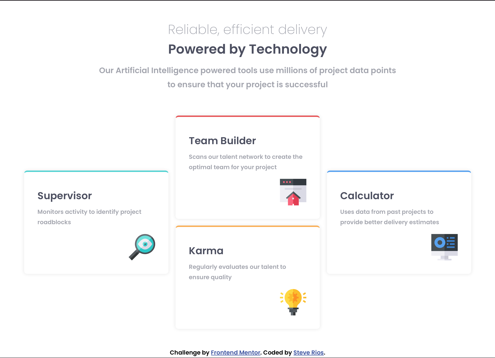

# Frontend Mentor - Four card feature section solution

This is a solution to the [Four card feature section challenge on Frontend Mentor](https://www.frontendmentor.io/challenges/four-card-feature-section-weK1eFYK). Frontend Mentor challenges help you improve your coding skills by building realistic projects.

## Table of contents

- [Overview](#overview)
  - [The challenge](#the-challenge)
  - [Screenshot](#screenshot)
  - [Links](#links)
- [My process](#my-process)
  - [Built with](#built-with)
- [Author](#author)

## Overview

### The challenge

Users should be able to:

- View the optimal layout for the site depending on their device's screen size

### Screenshot

### Links

- Solution URL: [https://github.com/peanutbutterjlly/frontEndMentor/tree/main/four-card-feature-section-master](https://github.com/peanutbutterjlly/frontEndMentor/tree/main/four-card-feature-section-master)
- Live Site URL: [https://steve-four-card-feature-section.netlify.app](https://steve-four-card-feature-section.netlify.app)

## My process

### Built with

- Semantic HTML5 markup
- CSS custom properties
- Flexbox
- CSS Grid

## Author

- Website - [Steve Rios](https://www.srios.net)
- Frontend Mentor - [@peanutbutterjlly](https://www.frontendmentor.io/profile/peanutbutterjlly)
- Twitter - [@steve_developr](https://www.twitter.com/steve_developr)
